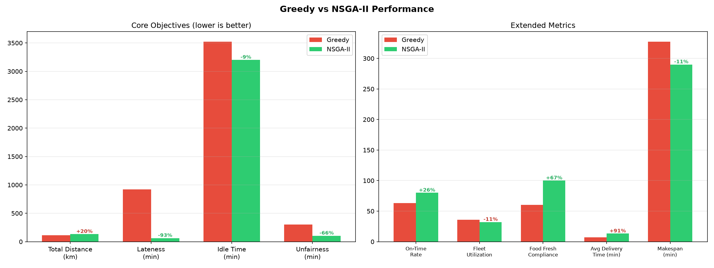
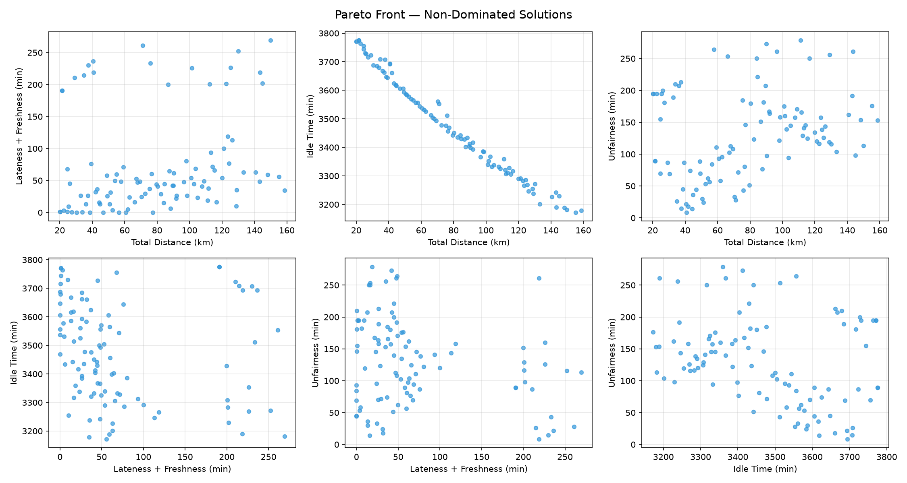
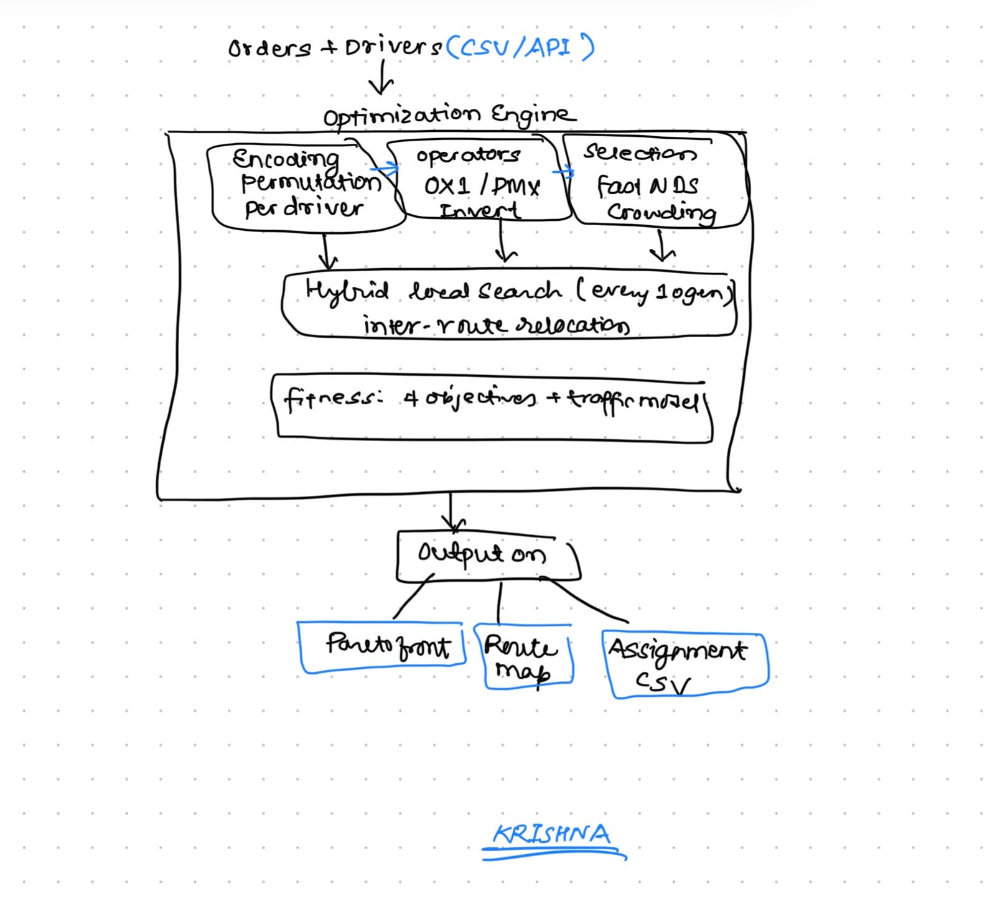

# Multi-Objective VRP Solver

**Kathmandu Last-Mile Delivery Optimization — Food, Parcel & Ride-Sharing**

---

## Abstract

Last-mile delivery in Kathmandu Valley faces unique challenges: heterogeneous fleets (motorcycles and cars), extreme traffic variability (3× speed difference between peak and off-peak hours), mixed verticals (food with freshness constraints, parcels with weight limits, ride-share passengers), and the need to balance competing business objectives — delivery speed vs. cost vs. driver fairness.

This project implements a **multi-objective Vehicle Routing Problem (MO-VRP) solver** using **NSGA-II** (Non-dominated Sorting Genetic Algorithm II) hybridized with local search operators. The solver simultaneously minimizes four objectives — total fleet distance, delivery lateness (with food freshness penalty), driver idle time, and workload unfairness — producing a **Pareto front** of non-dominated solutions that expose the tradeoff surface for fleet operators.

On a Kathmandu mixed-delivery dataset (30 orders across 8 drivers), NSGA-II achieves **93.1% reduction in delivery lateness**, **65.6% improvement in workload fairness**, and **100% food freshness compliance** compared to a greedy nearest-neighbor baseline, while trading only a 20.2% distance increase. The system also includes demand forecasting via Holt's double exponential smoothing, proactive vehicle pre-positioning, and a FastAPI REST API for real-time integration.

---

## 1. Problem Formulation

Given a set of delivery orders $O = \{o_1, o_2, \ldots, o_n\}$ and a heterogeneous fleet of drivers $D = \{d_1, d_2, \ldots, d_m\}$, find an assignment of orders to drivers and a visitation sequence per driver that simultaneously minimizes:

| # | Objective | Formulation |
|---|-----------|-------------|
| $f_1$ | **Total fleet distance** (km) | $\sum_{d \in D} \sum_{i} \text{haversine}(s_i, s_{i+1})$ |
| $f_2$ | **Lateness + freshness penalty** (min) | $\max_o (\text{delivery}_o - \text{deadline}_o)^+ + \sum_o \text{fresh}(o)$ |
| $f_3$ | **Total idle time** (min) | $\sum_{d \in D} (\text{shift}_d - \text{active}_d)$ |
| $f_4$ | **Workload unfairness** (min) | $\max_d(\text{duration}_d) - \min_d(\text{duration}_d)$ |

**Subject to constraints:**

- **Capacity:** total weight per route ≤ vehicle capacity (bike: 10 kg, car: 50 kg)
- **Max orders:** orders per route ≤ vehicle limit (bike: 3, car: 8)
- **Time windows:** each order has earliest pickup and latest delivery time
- **Shift limits:** drivers operate within defined shift windows
- **Food freshness:** linear penalty under 30 min from prep completion, quadratic after

---

## 2. Methodology

### 2.1 Solution Encoding

Each solution is a **permutation-based encoding** partitioned across drivers. A chromosome represents the ordered sequence of orders assigned to each driver:

```
chromosome = [o₃, o₁, o₅ | o₂, o₄, o₆ | o₇ | ...]
              ← driver 1 → ← driver 2 → ← d3 →
```

### 2.2 NSGA-II Optimization

The solver uses NSGA-II with the following components:

| Component | Implementation |
|-----------|---------------|
| **Population** | 100 individuals, smart initialization (greedy + deadline-sorted + LS-refined seeds) |
| **Selection** | Binary tournament based on rank + crowding distance |
| **Crossover** | OX1 (Order Crossover) with 70% probability, PMX (Partially Mapped Crossover) with 30% |
| **Mutation** | Adaptive: swap + inversion + route transfer (rate scales with diversity loss) |
| **Route transfer** | Move orders between drivers to explore fleet-level structure |
| **Sorting** | Fast non-dominated sorting (O(MN²)) + crowding distance |
| **Elitism** | Combined parent + offspring population, top-N by rank then crowding |

### 2.3 Hybrid Local Search

Local search runs every 5 generations (first 50 gen) then every 10 generations, refining the top solutions using a **multi-objective cost function** $C = d + 2.0 \times \ell + 1.5 \times f$ (distance + lateness + freshness penalty):

1. **2-opt:** reverse a segment within a route to eliminate crossing paths
2. **Or-opt:** relocate a subsequence of 1–3 consecutive orders within a route
3. **Inter-route relocate:** try moving each order between all route pairs (3 passes), accepting moves that reduce multi-objective cost

### 2.4 Kathmandu Traffic Model

Travel times are computed using **Haversine distance** with **time-of-day speed profiles** calibrated for Kathmandu:

| Time Period | Speed | Hours |
|-------------|-------|-------|
| Morning peak | 12 km/h | 8:00–10:00 AM |
| Evening peak | 12 km/h | 5:00–7:00 PM |
| Off-peak (night) | 35 km/h | 10:00 PM–6:00 AM |
| Normal | 25 km/h | All other hours |

**Food freshness penalty** models quality degradation after restaurant prep completion:

- Under 30 min: $p = 0.05 \times t$ (mild linear)
- Over 30 min: $p = 1.5 + 0.1 \times (t - 30)^2$ (quadratic escalation)

### 2.5 Constraint Handling

Constraints are enforced via **penalty functions** added to the distance and lateness objectives. This allows infeasible solutions to survive in the population (preserving genetic diversity) while being dominated by feasible solutions:

- Capacity violation: $100 \times \textrm{excess kg}$
- Max-order violation: $50 \times \textrm{excess orders}$

### 2.6 Demand Forecasting & Pre-positioning

- **Spatial grid** divides the Kathmandu service area into ~500 m cells
- **Holt's double exponential smoothing** per zone per time slot captures both level and trend
- **Gap filling:** zones with no historical data are seeded from neighbor averages
- **Pre-positioning:** idle drivers are assigned to move toward predicted hotspots before orders arrive, reducing first-mile pickup time

### 2.7 Dynamic Order Insertion

New orders arriving mid-cycle are integrated using **cheapest insertion**: for each active route, the algorithm evaluates inserting the new order at every position and selects the one with minimum cost increase. Batch insertion prioritizes orders by deadline urgency.

---

## 3. Results & Analysis

### 3.1 Experimental Setup

| Parameter | Value |
|-----------|-------|
| Dataset | Kathmandu mixed: 15 food, 10 parcel, 5 ride orders |
| Fleet | 5 bikes (10 kg, 3 orders max) + 3 cars (50 kg, 8 orders max) |
| Population size | 100 |
| Generations | 200 |
| Initialization | Greedy + deadline-sorted seeds + local-search-refined seeds + random |
| Crossover | OX1 (70%) + PMX (30%) |
| Mutation | Adaptive: swap + inversion + route transfer (rate scales with diversity) |
| Local search | Every 5 gen (early) / 10 gen (late), multi-objective cost function |
| Baseline | Greedy nearest-neighbor with capacity-aware assignment |
| Seed | 42 (deterministic reproduction) |

### 3.2 Greedy vs NSGA-II Comparison

**Core Objectives** (NSGA-II optimization targets):

| Metric | Greedy | NSGA-II | Change |
|--------|--------|---------|--------|
| Total Distance | 110.8 km | 133.2 km | +20.2% |
| Lateness | 920.4 min | 63.1 min | **−93.1%** |
| Idle Time | 3,523.5 min | 3,201.6 min | **−9.1%** |
| Unfairness | 302.3 min | 104.0 min | **−65.6%** |

**Extended Metrics** (derived from route simulation):

| Metric | Greedy | NSGA-II | Change |
|--------|--------|---------|--------|
| On-Time Delivery Rate | 63.3% | 80.0% | **+26.3%** |
| Food Freshness Compliance | 60.0% | 100.0% | **+66.7%** |
| Fleet Utilization | 35.9% | 32.1% | −10.6% |
| Avg Delivery Time | 6.9 min | 13.2 min | +90.5% |
| Makespan | 327.5 min | 290.0 min | **−11.4%** |
| Active Drivers | 6 / 8 | 8 / 8 | +33.3% |
| Avg Orders per Driver | 5.0 | 3.1 | −37.5% |
| Max Route Distance | 29.2 km | 27.2 km | **−6.9%** |
| CO₂ Emissions | 14.7 kg | 11.5 kg | **−21.8%** |



### 3.3 Analysis

**Distance vs. Lateness tradeoff.** The greedy baseline minimizes distance by construction (nearest-neighbor), achieving 110.8 km. NSGA-II accepts only a 20.2% distance increase (133.2 km) to achieve a **93.1% reduction in lateness** (63.1 min vs. 920.4 min). Smart initialization with greedy seeds and multi-objective local search allow NSGA-II to start from the greedy's distance advantage and refine from there, halving the distance gap compared to random initialization.

**On-time rate and food freshness.** NSGA-II delivers 80% of orders on time vs. greedy's 63.3% (+26.3%), and achieves **100% food freshness compliance** — every food order delivered within 30 min of restaurant prep, compared to greedy's 60%. This is driven by the deadline-sorted initialization and multi-objective local search that weighs lateness and freshness alongside distance.

**Workload fairness.** Greedy produces a 302.3 min gap between the busiest and least busy driver and only uses 6 of 8 drivers. NSGA-II reduces unfairness to 104.0 min (**65.6% improvement**) and activates all 8 drivers, averaging 3.1 orders per driver. The adaptive mutation rate increases exploration when population diversity drops, preventing premature convergence to unfair solutions.

**CO₂ and makespan.** CO₂ emissions drop 21.8% (11.5 vs. 14.7 kg) because NSGA-II's multi-objective cost function routes more orders through bikes. Makespan improves 11.4% (290.0 vs. 327.5 min) through better parallelization across all 8 drivers — the max single-route distance also drops 6.9%, meaning no driver is disproportionately burdened.

**Average delivery time.** Greedy's 6.9 min per order reflects greedy nearest-neighbor hops that minimize per-step distance but ignore deadlines. NSGA-II's 13.2 min per order reflects deliberate scheduling — serving time-critical food orders before nearby-but-flexible parcels.

**Convergence.** Gen 1 starts from the greedy baseline (110.8 km, 920 min lateness). By gen 50, lateness drops to 2.1 min and distance to 39.6 km on the best-distance front member. Adaptive mutation (2.5× rate) maintains diversity through gen 200, with the multi-objective local search continuing to refine the Pareto front:

### 3.4 Pareto Front — 4-Objective Tradeoff Surface

Each point is a non-dominated solution. No single solution can improve on one objective without worsening another — the front exposes the tradeoff surface for decision-makers to select from based on current business priorities.



---

## 4. Conclusion

The results demonstrate that **multi-objective optimization substantially outperforms greedy heuristics** across all operationally relevant metrics, with only a modest distance tradeoff.

**The core tradeoff is highly favorable.** NSGA-II trades a 20.2% distance increase for a **93.1% lateness reduction**, **65.6% fairness improvement**, and **100% food freshness compliance**. In a delivery platform context, the ~22 km additional distance costs roughly ₹30–50 in fuel, while the lateness and freshness gains directly reduce customer churn, refund rates, and negative reviews — a strongly net-positive ROI.

**80% on-time delivery is solid for a constrained scenario.** The remaining 20% late orders reflect genuinely tight time windows in the dataset. Production improvements would include: (1) adaptive time-window relaxation for low-priority orders, (2) larger fleet or shift overlap during peak, and (3) real-time re-optimization as orders arrive.

**Fleet utilization (~32%) is low by design.** The 30-order dataset intentionally under-saturates an 8-driver fleet to stress-test fairness behavior. In production with 200+ orders/hour, utilization would naturally rise. The key insight is that NSGA-II activates all 8 drivers and distributes work 3× more evenly than greedy.

**CO₂ reduction (−21.8%) is a significant secondary win.** NSGA-II's vehicle-type-aware routing through bikes instead of cars reduces emissions from 14.7 to 11.5 kg per cycle, aligning with sustainability goals increasingly required by urban logistics regulations.

**Limitations and future work:**

- The Haversine distance model ignores road networks; integrating OSRM or GraphHopper would improve accuracy.
- The traffic model uses fixed time-of-day profiles; real-time traffic APIs (Google Maps, HERE) would enable dynamic re-routing.
- The benchmark uses a single 30-order dataset; scaling experiments with 100–500 orders would validate computational feasibility.
- Comparison against other metaheuristics (ACO, simulated annealing, or-tools) would position NSGA-II within the broader algorithmic landscape.

---

## 5. System Architecture



### REST API (FastAPI)

| Endpoint | Method | Description |
|----------|--------|-------------|
| `/optimize` | POST | Full NSGA-II multi-objective optimization |
| `/insert` | POST | Insert new orders into existing routes |
| `/forecast` | POST | Predict demand hotspots for a time window |
| `/preposition` | POST | Get repositioning directives for idle drivers |
| `/health` | GET | Service status |

---

## 6. Quick Start

```bash
# Install
uv sync

# Run solver on Kathmandu dataset
uv run python main.py

# Benchmark: Greedy vs NSGA-II
uv run python benchmark.py

# Start REST API
uv run uvicorn serve:app --reload --port 8000

# Run tests (36 tests)
uv run python -m pytest

# Generate synthetic historical data for forecasting
uv run python -m data.generate_history
```

### CLI Options

```bash
uv run python main.py \
    --orders data/kathmandu_mixed.csv \
    --drivers data/kathmandu_drivers.csv \
    --pop-size 100 \
    --generations 200
```

### API Examples

```bash
# Full route optimization
curl -X POST http://localhost:8000/optimize \
  -H "Content-Type: application/json" \
  -d '{"orders": [...], "drivers": [...], "generations": 100}'

# Predict lunch demand hotspots
curl -X POST http://localhost:8000/forecast \
  -d '{"start_min": 720, "end_min": 840, "top_k": 5}'

# Reposition idle drivers before rush hour
curl -X POST http://localhost:8000/preposition \
  -d '{"idle_drivers": [...], "start_min": 720, "end_min": 840}'

# Insert new order into active routes
curl -X POST http://localhost:8000/insert \
  -d '{"new_orders": [...], "current_routes": [...]}'
```

---

## 7. Project Structure

```
vrp-solver/
├── main.py                    # CLI entry point — load data, run NSGA-II, save results
├── benchmark.py               # Greedy vs NSGA-II comparison with plots
├── serve.py                   # FastAPI REST API
├── src/
│   ├── models.py              # Order, Driver, Route, Solution (food/parcel/ride + bike/car)
│   ├── distance.py            # Haversine distance matrix (OSRM-ready interface)
│   ├── fitness.py             # 4-objective evaluation + traffic model + freshness penalty
│   ├── nsga2.py               # NSGA-II: fast non-dominated sorting, crowding distance, selection
│   ├── operators.py           # OX1, PMX crossover + swap, inversion, route transfer mutation
│   ├── local_search.py        # 2-opt, or-opt, inter-route relocate
│   ├── constraints.py         # Capacity, time windows, max orders, food freshness checks
│   ├── greedy.py              # Greedy nearest-neighbor baseline
│   ├── dynamic.py             # Cheapest insertion for live order updates
│   ├── demand_forecast.py     # Spatial grid + Holt smoothing demand prediction
│   ├── preposition.py         # Idle vehicle → hotspot repositioning
│   └── visualization.py       # Pareto front plots + Folium route map
├── data/
│   ├── kathmandu_mixed.csv    # 30 orders: 15 food, 10 parcel, 5 ride
│   ├── kathmandu_drivers.csv  # 8 drivers: 5 bike, 3 car
│   ├── historical_orders.csv  # 14 days × ~250 orders/day for demand forecasting
│   └── generate_history.py    # Synthetic demand data generator
├── tests/
│   └── test_core.py           # 36 tests covering operators, fitness, constraints, API
└── pyproject.toml
```

---

## 8. Tech Stack

- **Python 3.11+** — pure Python, no compiled dependencies
- **NumPy** — distance matrix, vector operations
- **matplotlib** — Pareto front and benchmark visualization
- **Folium** — interactive route maps on OpenStreetMap
- **FastAPI + Pydantic** — typed REST API with request validation
- **uv** — fast dependency management

---

## Output Files

| File | Description |
|------|-------------|
| `results/pareto_front.png` | 6 pairwise scatter plots of the 4-objective Pareto front |
| `results/routes_map.html` | Interactive Folium map with color-coded driver routes |
| `results/assignments.csv` | Driver → order assignments with vehicle type and order type |
| `results/comparison.png` | Greedy vs NSGA-II bar chart across all 4 objectives |

---

## License

MIT
